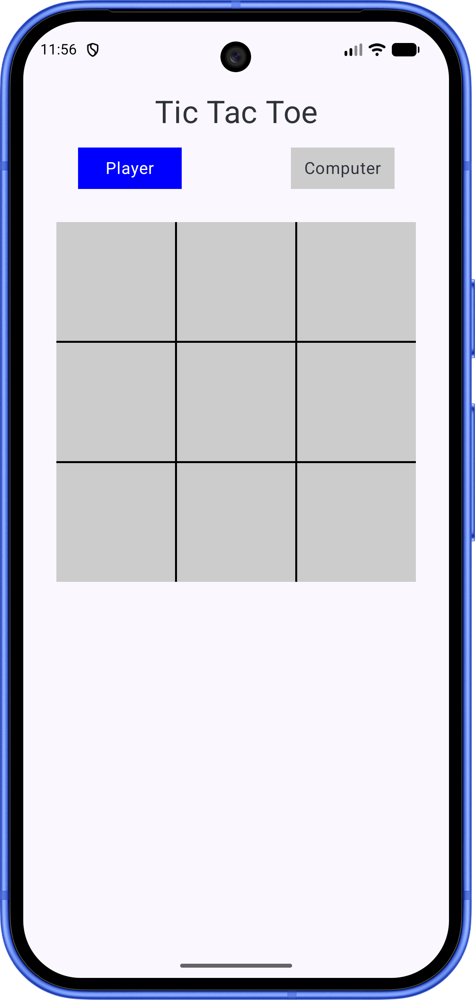
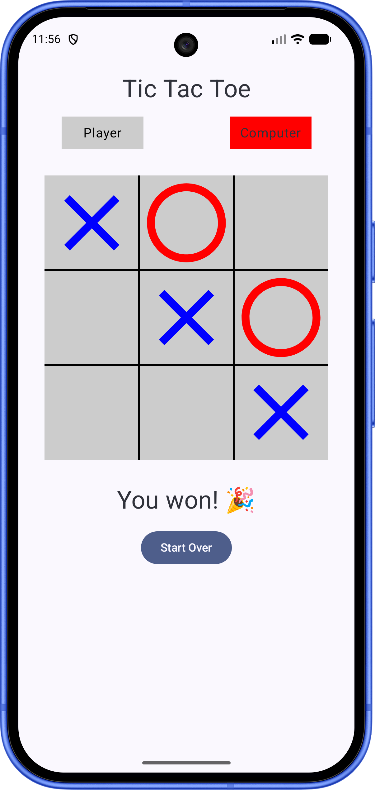
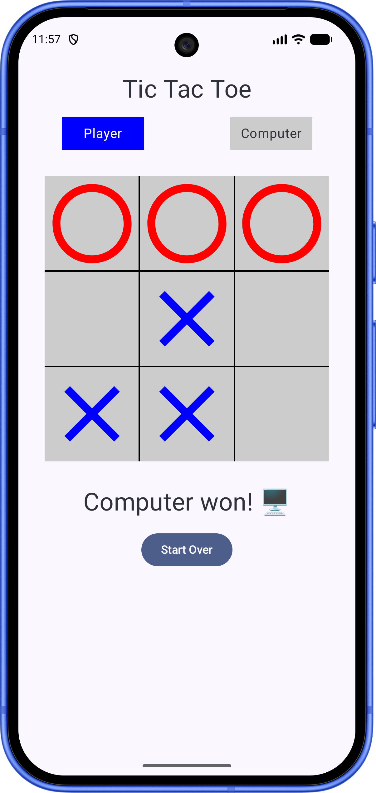

# TicTacToe

A native Android Tic-Tac-Toe game, built with Kotlin and Jetpack Compose.

## Screenshots

<p>
  
  
  
</p>

## Tech Stack

- **Language:** Kotlin
- **UI:** Jetpack Compose, Material 3
- **Min SDK:** 24 · **Target SDK:** 37

## Status

✅ Playable — 3x3 board, turn-based play against the computer, win/draw detection, and a
start-over flow are all implemented. Game state is held in `TicTacToeViewModel`.

## Roadmap

- [x] 3x3 game board UI
- [x] Turn-based X/O placement logic
- [x] Win and draw detection
- [x] Reset / play-again flow
- [ ] Smarter computer opponent (currently picks a random open square)

## Getting Started

1. Clone the repo:
   ```
   git clone https://github.com/haidershah/TicTacToe.git
   ```
2. Open the project in Android Studio.
3. Run on an emulator or physical device (API 24+).
